# PBO-Tugas-1
Pembuatan Program Investasi.java.Investasi Sederhana Berbasis Command Line

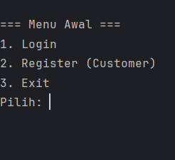

Diawal user menggunakan program investasi ini akan memunculkan menu yang memiliki pilihan
login, registrasi (untuk membuat akun user), dan exit

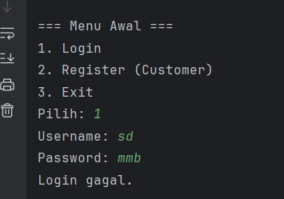

Jika user memilih pilihan 1 yakni login, program akan menampilkan username dan password yang
nantinya user akan memasukkan username dan password yang sudah dibuat pada menu registrasi.
Ketika user salah memasukkan username atau password maka user akan gagal melakukan login

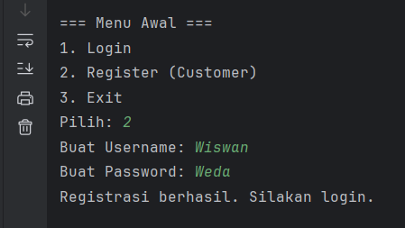

Jika user memilih pilhan 2 yakni register, maka user akan membuat sebuah akun dan diminta 
input beberapa data seperti username dan password. Program akan menampilkan 
"Registrasi berhasil. Silakan login." jika akun berhasil dibuat

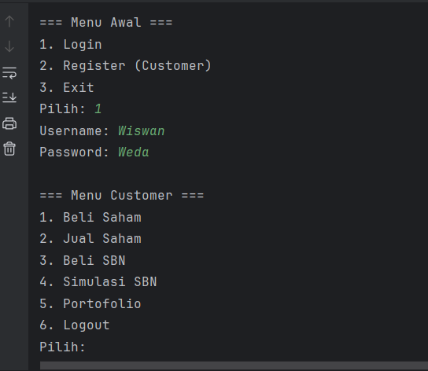

Saat user merhasil melakukan login pada menu login, selanjutnya program akan menampilkan 
beberapa menu investasi seperti beli saham, jual saham, beli sbn, simulasi sbn, portofolio,
dan logout.

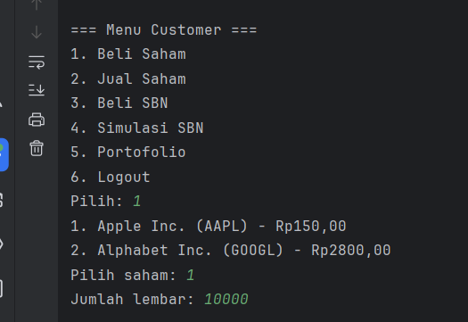

Pada menu ini user akan diminta untuk memilih saham apa yang akan dibeli lalu setelah memilih 
saham pada pilihan user akan dimita berapa banyak lembar saham yang nantinya akan dibeli
tanpa terjadi eror atau invalid dalam melakukan pembelian saham

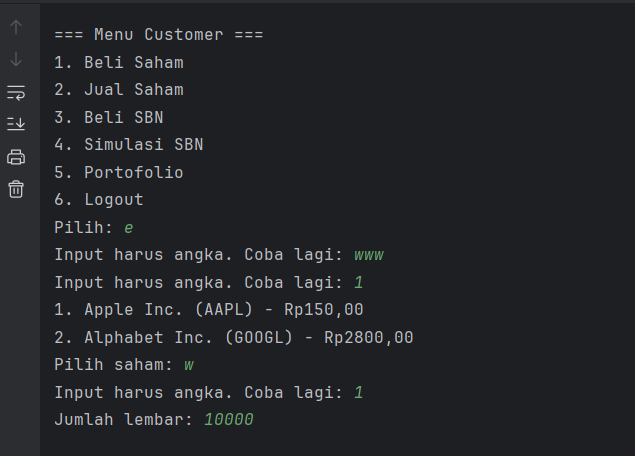

Pada tampilan ini merupakan ketika user invalid atau salah dalam pembelian saham. Yang dimana
user yang seharusnya input sesua dengan pilihan malah memilih yang tidak ada di dalam pilihan
menu, kemudian program akan meminta user untuk input sesuai dengan apa yang diminta pada program
sampai sesuai dengan apa yang tertera pada program atau sampai valid dalam pembelian saham

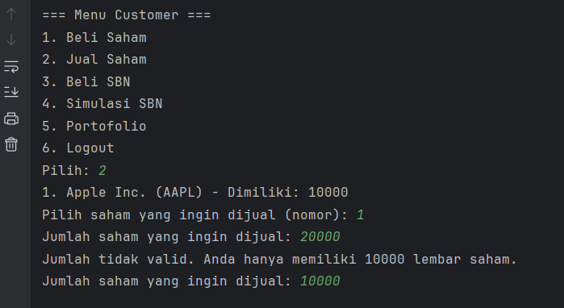

User pun bisa melakukan penjualan saham, menu ini merupakan menu penjualan saham yang dapat dijual oleh
user. Program pun menampilkan saham apa saja yang dapat dipilih dan dijual, user tidak bisa menjual saham
yang tidak dimiliki dan menjual lebih dari yang dimiliki oleh user

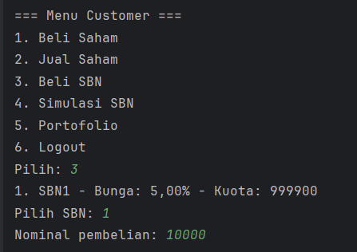

Jika user memilih pilihan 3 atau beli SBN, user akan diminta untuk memilih SBN apa yang akan 
dibeli lengkap dengan bunganya lalu setelah memilih SBN pada pilihan user akan dimita berapa 
banyak nominal SBN yang nantinya akan dibeli tanpa terjadi eror atau invalid dalam melakukan pembelian SBN

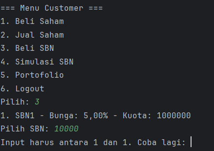

Sama seperti kasus validasi sebelumnya jika user membeli yang bukan atau tidak ada yang ada pada pilihan
maka user akan diminta lagi untuk input pilihan sampai pilihan user ada atau benar

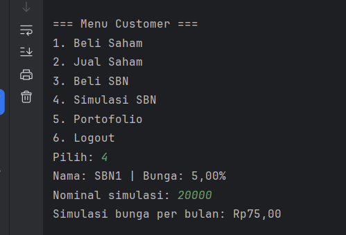

Pada menu ini merupakan sebuah simulasi dari jika user ingin membeli SBN. Seperti seberapa besar bunga
yang akan dibayarkan jika user membeli sbn tersebut dan tentunya sudah terdapat validasi input

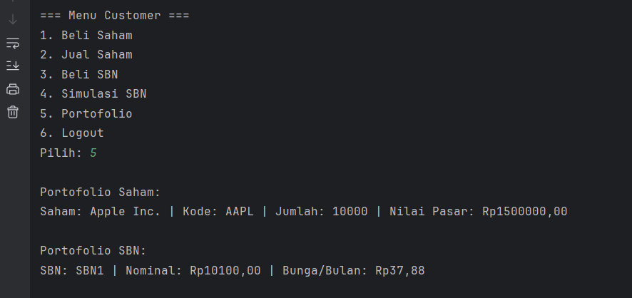

User juga dapat melihat saham dan SNB yang dimiliki dengan memilih menu portofolio. Pada menu ini
program akan menampilkan saham dan SNB yang dimiliki user, nilai pasar dari saham beserta bunga SNB

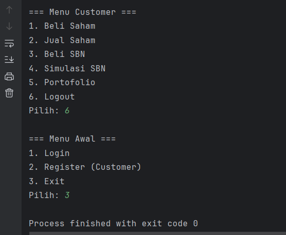

Ini merupakan tampilan menu jika user memilih untuk logout, setelah user logout user akan dikembalikan
pada menu pilihan pertama dan user bisa kembali membuat akun, login, ataupun exit.
Jika user memilih untuk exit maka program akan berhenti beroprasi
